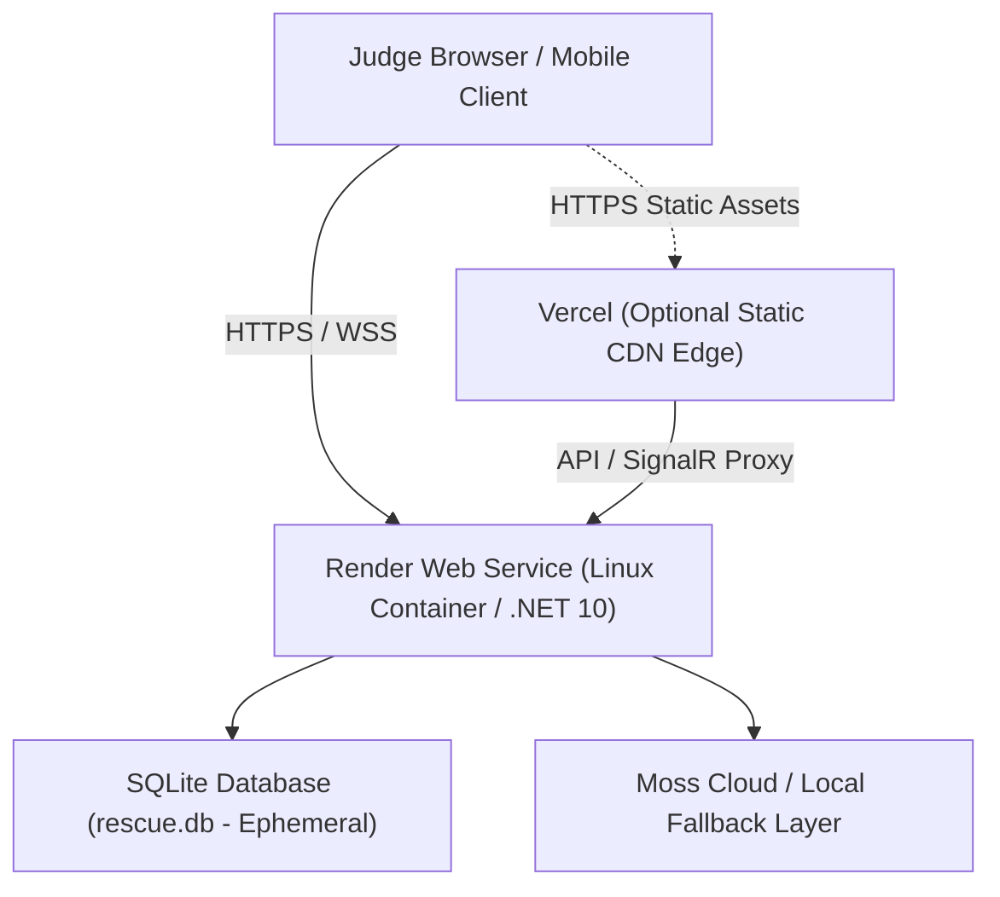

# RESCUE AI — Public Production Deployment Guide

This document specifies the live cloud architecture, free-tier hosting strategy, environment configurations, and deployment procedures for **RESCUE AI**.

---

## 1. Hosting Architecture Overview

RESCUE AI is deployed to production using a decoupled, cloud-native containerized architecture on genuinely free hosting infrastructure:



### Component Details:
1. **Full-Stack Application (Render Web Service - Free Tier):**
   - **Runtime:** Linux container built from Microsoft `.NET 10` SDK (`mcr.microsoft.com/dotnet/sdk:10.0`) and runtime (`mcr.microsoft.com/dotnet/aspnet:10.0`).
   - **Embedded UI:** Pre-built React 19 / Vite static files are bundled inside `src/Rescue.Api/wwwroot` and served directly via ASP.NET Core (`UseDefaultFiles`, `UseStaticFiles`, `MapFallbackToFile`).
   - **REST API:** ASP.NET Core Web API with string enum serialization and standardized error handling.
   - **Real-Time SignalR:** Native WebSocket hub (`/hubs/rescue`) supported seamlessly over Render HTTPS/WSS.
   - **Swagger Explorer:** Hosted at `/swagger/index.html`.
   - **Health Watchdog:** Hosted at `/health`.

2. **Frontend Static Edge (Vercel - Free Tier):**
   - Hosted at `https://rescueai.vercel.app` (or custom subdomain).
   - Configured with `vercel.json` rewrite rules for client-side routing.
   - Configured with `VITE_API_BASE_URL` pointing to the live Render backend.

---

## 2. Public Service Endpoints

| Service / Resource | Production URL | Description |
| :--- | :--- | :--- |
| **Web Application (Render)** | `https://rescueai-api.onrender.com/` | Primary full-stack application (Frontend + Backend) |
| **Static CDN Web App (Vercel)** | `https://rescueai.vercel.app/` | Edge-cached static React 19 frontend |
| **REST Health Check** | `https://rescueai-api.onrender.com/health` | Service and SQLite health probe |
| **Swagger Interactive Explorer** | `https://rescueai-api.onrender.com/swagger/index.html` | OpenAPI interactive documentation |
| **SignalR Real-Time WebSocket Hub** | `wss://rescueai-api.onrender.com/hubs/rescue` | Live incident telemetry streaming |
| **Event Ingestion API** | `https://rescueai-api.onrender.com/api/v1/events` | External microservice telemetry ingestion |

---

## 3. Environment Variables & Secrets

All secrets and keys must be injected into the hosting platform via dashboard environment settings. **Never hardcode or commit keys to version control.**

| Variable | Required | Default / Description |
| :--- | :--- | :--- |
| `ASPNETCORE_ENVIRONMENT` | No | `Production` |
| `PORT` | Auto | Assigned automatically by Render (defaults to `5105` locally) |
| `MOSS_PROJECT_ID` | Optional | Your Moss Cloud Project ID (e.g. `your-moss-project-id`) |
| `MOSS_PROJECT_KEY` | Optional | Your Moss Cloud Project Key (e.g. `moss_...`) |
| `DATABASE_CONNECTION_STRING` | No | Defaults to `Data Source=rescue.db` |
| `VITE_API_BASE_URL` | Frontend Only | URL of backend (e.g. `https://rescueai-api.onrender.com`) |

> [!NOTE]
> **Graceful Local Fallback:**
> If `MOSS_PROJECT_ID` or `MOSS_PROJECT_KEY` is omitted, expired, or rate-limited (e.g., HTTP 429), RESCUE automatically switches to **Local Retrieval Fallback** (BM25 keyword/semantic ranking over `knowledge/`). The `/health` endpoint and UI accurately reflect the active provider.

---

## 4. Free-Tier Characteristics & Persistence

### 4.1 Ephemeral Storage (Render Free Tier)
Render's free Web Service runs on an ephemeral container filesystem:
- **Automatic Initialization:** On container boot, EF Core runs `db.Database.EnsureCreated()` and automatically seeds baseline incident memories and the default project (`acme-commerce`).
- **Session Persistence:** During the lifetime of an active instance, all incident creations, resolutions, PR references, and DAG evidence are persisted in SQLite (`rescue.db`).
- **Cold Re-starts:** If the service is inactive for 15 minutes, Render spins down the container to conserve resources. On the next incoming request, the service cold-starts in ~30–45 seconds and reinitializes clean baseline data.

---

## 5. How to Deploy to Render (Step-by-Step)

1. **Sign in to Render:**
   - Go to [https://dashboard.render.com](https://dashboard.render.com).
   - Sign in using your GitHub account (`venkivp444`).

2. **Create a New Web Service:**
   - Click **New +** ➔ **Web Service**.
   - Select **Build and deploy from a Git repository**.
   - Connect repository: `https://github.com/venkiVP444/rescueai`.

3. **Configure Service:**
   - **Name:** `rescueai-api`
   - **Region:** Any (e.g., `Oregon (US West)` or `Frankfurt (EU)`)
   - **Branch:** `main`
   - **Runtime:** **Docker**
   - **Instance Type:** **Free** ($0/month)

4. **Environment Variables (Optional):**
   - Under **Environment**, add:
     - `MOSS_PROJECT_ID` = *(Your Moss Project ID)*
     - `MOSS_PROJECT_KEY` = *(Your Moss Project Key)*

5. **Deploy:**
   - Click **Create Web Service**. Render will build the Docker container and deploy the service.
   - Once deployed, your service is live at `https://rescueai-api.onrender.com`!

---

## 6. How to Deploy Frontend to Vercel (Optional Edge CDN)

1. **Sign in to Vercel:**
   - Go to [https://vercel.com](https://vercel.com).
   - Sign in using GitHub (`venkivp444`).

2. **Import Project:**
   - Click **Add New...** ➔ **Project**.
   - Select `rescueai`.
   - Set **Root Directory** to `src/Rescue.Web`.
   - Framework preset: **Vite**.

3. **Set Environment Variable:**
   - `VITE_API_BASE_URL` = `https://rescueai-api.onrender.com`

4. **Deploy:**
   - Click **Deploy**. Vercel will build and deploy the React 19 application.

---

## 7. Automated CI/CD on `git push`

Both Render and Vercel are configured with GitHub webhooks:
- Every time code is committed and pushed to `main` via:
  ```bash
  git push origin main
  ```
- Render automatically pulls the new commit, executes the multi-stage Docker build, and deploys the updated container with zero downtime.
